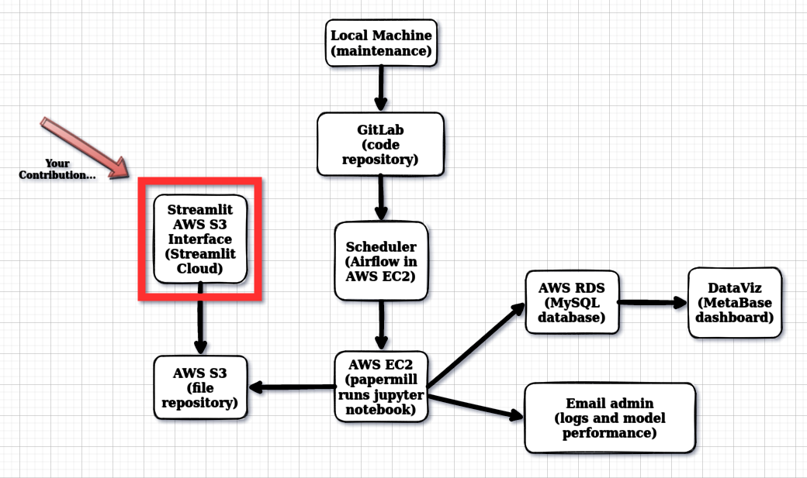

# **BUSINESS UNDERSTANDING**

## **What is the company?**

All In One Place

## **What is its business model?**

The All in One Place company is a multi-brand outlet company that sells second-line products of several brands at a lower price through e-commerce.

## **What is the business problem the company is facing?**

Within just one year of operation, the marketing team realized that some customers buy more expensive products with high frequency and contribute to a significant portion of the company's revenue.

Based on this perception, the marketing team will launch a loyalty program for the best customers in the company's base, called Insiders. However, the team does not have advanced knowledge of data analysis to select program participants.

For this reason, the marketing team asked the data team to select eligible customers for this loyalty program using advanced data manipulation techniques. 

# **PROBLEM UNDERSTANDING**

## **What is the business solution that this project has to deliver?**

As a data scientist of All In One Place company, you need to determine who are the customers eligible to participate in the Insiders program. Once this list is ready, the Marketing team will carry out a sequence of personalized and exclusive actions to this group of people to increase their sales and purchase frequency.

As a result of this project, you must submit a list of people eligible to participate in the Insiders program, along with a report answering the following questions:
* *Who are the people eligible to participate in the Insiders program?*
* *How many customers will be part of the group?*
* *What are the main characteristics of these customers?*
* *What is the percentage of revenue contribution that comes from the Insiders group?*
* *What are the conditions for a person to be eligible for the Insiders program?*
* *What are the conditions for a person to be removed from the Insiders program?*

**References:**

https://sejaumdatascientist.com/como-criar-um-programa-de-fidelidade-para-empresa/
    
https://www.kaggle.com/vik2012kvs/high-value-customers-identification

# **BUSINESS ASSUMPTIONS**

*-> invoices where items have negative quantity were not considered (were removed)*

*-> invoices where items have zero unit price were not considered (were removed)*

*-> invoices where items have no description were not considered (were removed)*

*-> invoices where customer id is unknown were not considered (were removed) as we may want to identify who exactly is a given customer*

*-> negative product quantity means the product was returned so that the company had the refund the product value. Consequently, its price was considered as a negative number*

*-> customers that return more products than purchased were not considered (were removed)*

*-> items with stock code that has only letters and no number (such as W',  'CRUK',  'J',  'BL') seem to have no product description. These items weren't considered on the total_diff_items variable calculation*

*-> items with stock codes such as 47566 and 47566B were assumed to be different products*

*-> product unit price is in American dollars*

*-> based on data analysis, invoice_no that starts with string C seems to mean a product with a negative quantity. Therefore, this is also one assumption*

# **SOLUTION STRATEGY**

### Input

- **Business problem**: segment customers into groups and find the high-value customers.
- **Business questions**: described in the preceding section
- **Available data**: dataset with all transactions between Nov-2016 to Dec-2017.

### Output

- **Online Dashboard** with Insiders information
- **Report** with answers to the following business questions:

- - *Who are the people eligible to participate in the Insiders program?*

- - *How many customers will be part of the group?*

- - *What are the main characteristics of these customers?*

- - *What is the percentage of revenue contribution that comes from the Insiders group?*

- - *What are the conditions for a person to be eligible for the Insiders program?*

- - *What are the conditions for a person to be removed from the Insiders program?*

### Tasks
- Who are the people eligible to participate in the Insiders program? 

- - What does "be eligible" mean? What exactly is a "high-value customer" for the company?

- - We assume that high-value is a synonym of Lifetime Value (LTV)

- How many customers will be part of the group?

- - Determine Insiders cluster

- - Count how many customers there are in this group

- - Count percentage of the Insiders customers to the total number of customers

- What are the main characteristics of these customers?

- - Determine Insiders cluster

- - Describe Insiders customers in terms of average purchase characteristics

- What is the percentage of revenue contribution that comes from the Insiders group?

- - Determine Insiders cluster

- - Determine Insiders cluster revenue contribution

- - Determine total revenue for all clusters

- What are the conditions for a person to be eligible for the Insiders program?

- - Determine Insiders cluster

- - Determine what time interval must be considered for eligibility.

- - Determine, in terms of purchase behaviour, how close to the centroid of Insiders cluster a customer must be to be considered as Insider

- What are the conditions for a person to be removed from the Insiders program?

- - Determine Insiders cluster

- - Determine what time interval must be considered for eligibility

- - Determine, in terms of purchase behaviour, how far from the centroid of the Insiders cluster an Insider customer is allowed to deviate

# **PROJECT CYCLE**

## Step 01. Imports
Import required libraries and functions.

## Step 02. Data Extraction:
For the available data, check files and data fields description. Then load data from CSV file.

## Step 03. Data Description:
Rename columns and check the number of rows in the table (does it requires big data tools?). Handle missing values and convert data types. Then use statistics metrics to identify data outside the scope of business.

## Step 04. Data Filtering:
Filter rows and select columns that do not contain relevant information for modelling or do not match the scope of the business.

## Step 05. Feature Engineering:
Create a hypothesis list to check on the final Exploratory Data Analysis section. Then create relevant variables for the project.

## Step 06. Exploratory Data Analysis:
Analyse each variable alone and then the relationship among variables. Then, explore the data to get an intuition about how data is distributed in data space.

## Step 07. Feature Selection:
Select the most significant attributes for training the model.

## Step 08. Data Preparation:
Prepare data so that the Machine Learning models can more easily learn and perform more accurately. Then create an embedded space for data.

## Step 09. Hyperparameter Fine Tuning:
Test different Machine Learning models and select the one with the best performance. Then, choose the best values for each parameter of the selected ML model.

## Step 10. Model Training:
Create the final Machine Learning model and measure its performance.

## Step 11. Cluster Analysis
Analyse clusters after Machine Learning modelling.

## Step 12. Exploratory Data Analysis:
Test business hypotheses and answer business questions.  

## Step 13. Deployment:
Plan deployment architecture and implement it.

# **TOP 3 INSIGHTS**

- **The Insiders group contribute to 60.05 of company revenue** 
- **On average, the amount of money the Insiders spent is 60x higher than the cluster with the least amount spent**
- **On average, the Insiders have a frequency 79% higher than the cluster with the second-highest frequency.**

# **BUSINESS SOLUTION**

**You can check the whole solution architecture for this project at the following image**

**You can check the final dashboard for this cycle at the following link**

http://insiders-project.herokuapp.com/public/dashboard/bf29cd43-922f-4a0c-bc2f-27d9d8336e29

# **CONCLUSIONS**

Clustering projects are complex because there is no straightforward guide to make decisions once we have no response variable, as was the case in supervised problems.

Clustering projects require us to make decisions heavily based on business understanding, much more than in a supervised data science problem.

Clustering projects require lots of exploration and also business intuition so as to get meaningful solutions.

# **LESSONS LEARNED**

**How to do an end-to-end unsupervised Data Science project.**

**How to use the AWS solutions (S3, EC2 and RDS) to create a more robust data science solution for the company.**

**How to create a Metabase dashboard and host it on Heroku cloud.**

**Create an interim solution so as to give the business team something to work on until a more elaborate solution is delivered.**

**Use business understanding to guide decisions throughout the project.**

**Focus on the business solution in order to not get lost on different tools to be used throughout the project**

**On the first project cycle, it's important to keep things simple and try not to get the best solution because this will only be achieved through many project cycles.**

# **NEXT STEPS TO IMPROVE**

**Streamlit**: create a user-friendly webpage with Streamlit so that users can upload data via a link. Validate this data before sending it to AWS S3 bucket

**Scheduler**: ask the business team how often the ML model must run and schedule it on AWS EC2.

**Dashboard**: ask the business team what is the most relevant information for the Metabase dashboard and create a new one.

**Embeddings**: test different embeddings so data can be more easily clusterized by ML models.

**Machine Learning Models**: test more ML models to find one with better results. 

**Hypotheses**: raise more business hypotheses and validate them with data.

**Code**: review the whole code once more to make it clearer and more efficient (faster and less resource-intensive).
